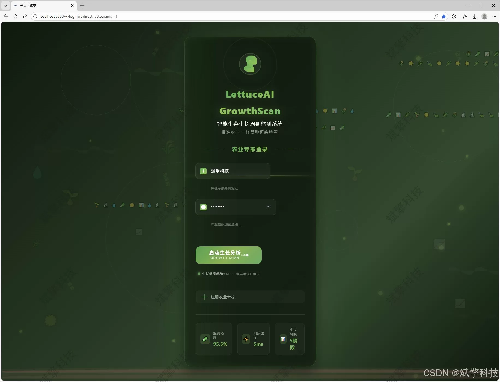
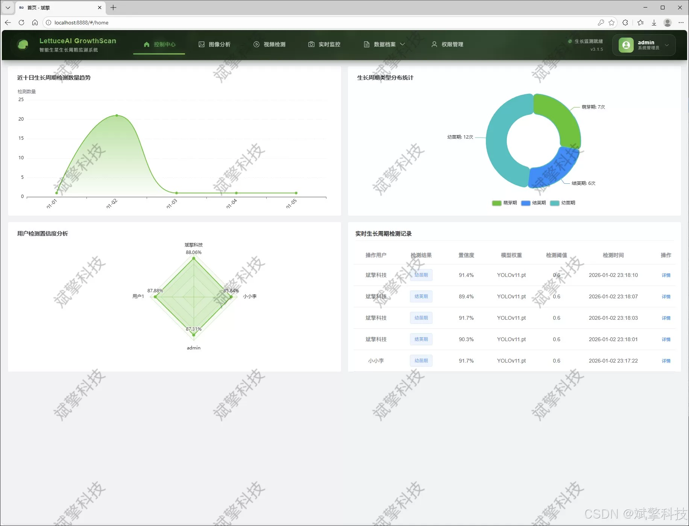
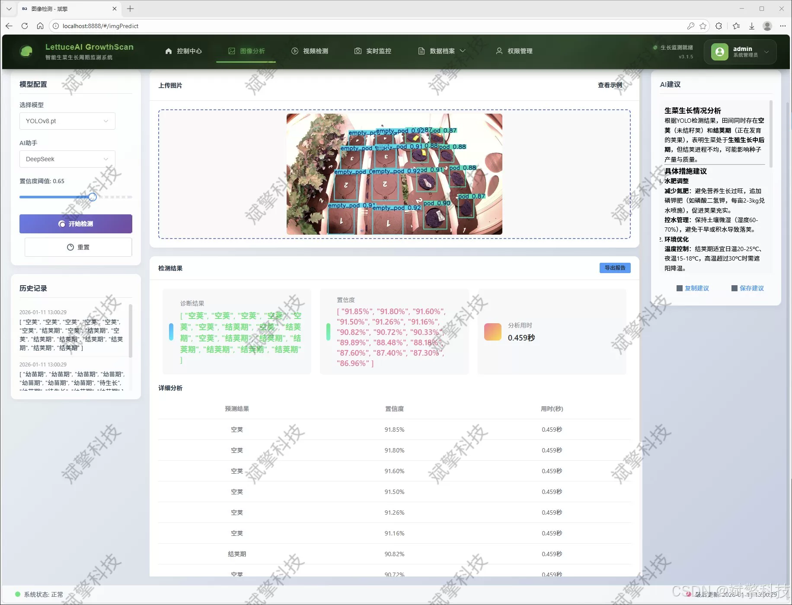
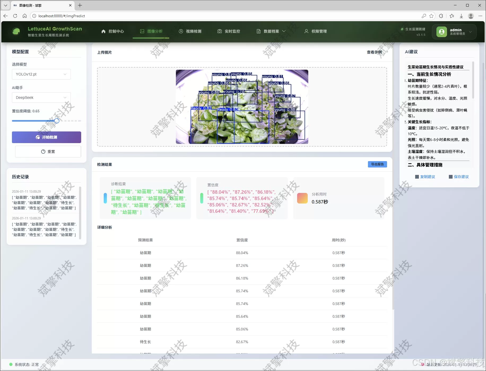
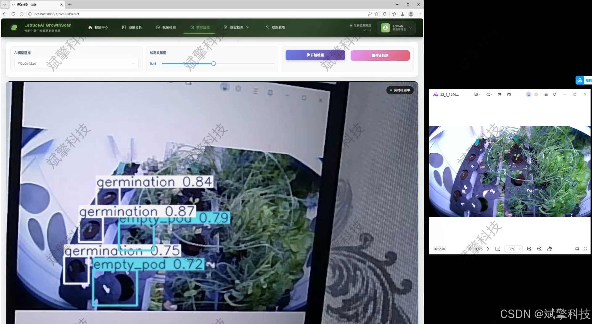
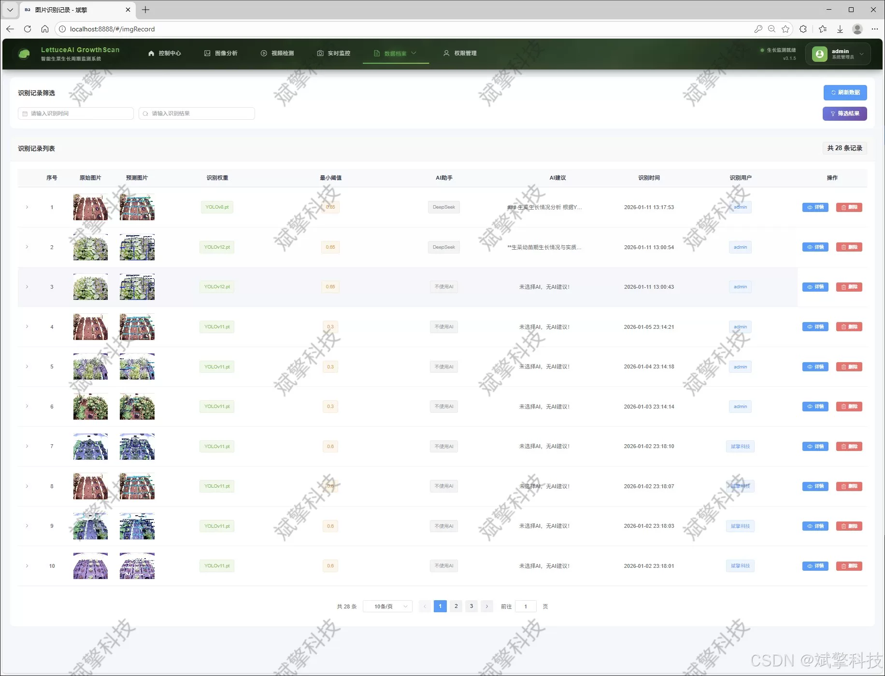
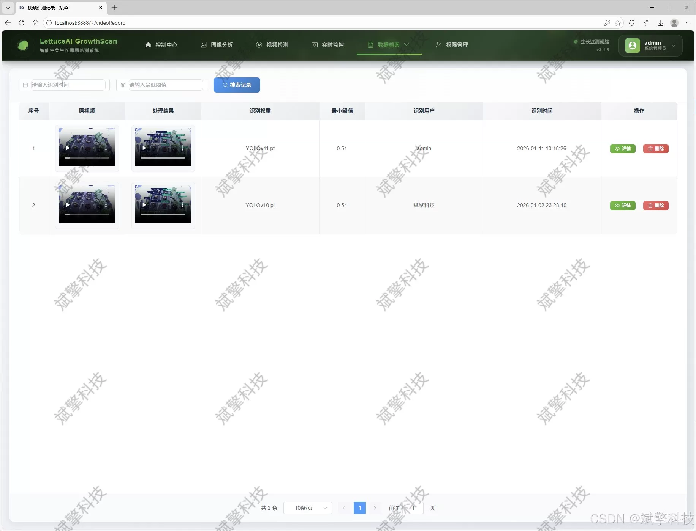
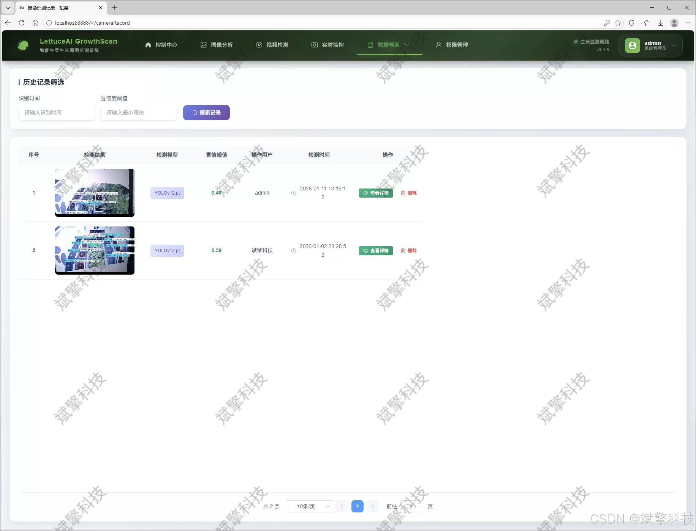
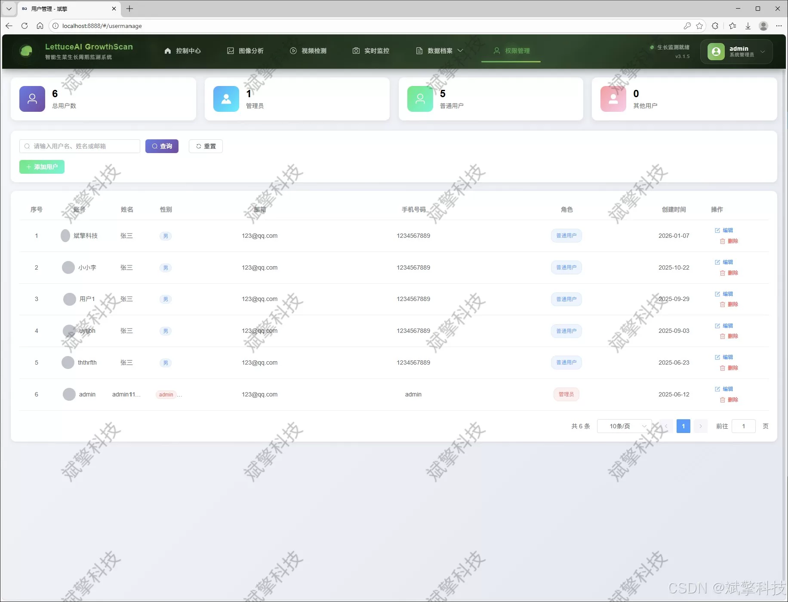

# Based on YOLO deep learning and the large models of Qianwen and DeepSeek for lettuce growth

## Body

Based on YOLO deep learning and the large models of Qianwen, DeepSeek intelligent analysis system for lettuce growth cycle detection (DeepSeek intelligent analysis + web interface + front-end separation + YOLO data + YOLOv8/YOLOv10/YOLOv11/YOLOv12)

This paper designs and implements an intelligent detection and analysis system for lettuce growth cycle based on the latest multi-version YOLO object detection algorithm and SpringBoot backend framework. Targeting the demand for automated and refined monitoring of crop growth status in modern agriculture, the system takes hydroponic lettuce as a typical scenario, constructing a specialized image dataset including five growth stages: 'Ready' (harvestable), 'empty_pod' (empty planting basket), 'germination' (germination period), 'pod' (planting basket), 'young' (young seedlings). The dataset consists of 1410 labeled images. The core of the system adopts modular design, supporting flexible switching and comparison among YOLOv8, YOLOv10, YOLOv11, and YOLOv12 high-performance models to achieve optimal detection accuracy and speed. The system combines the intelligence analysis capabilities of the DeepSeek large language model to generate natural language descriptions and agricultural recommendations from the detection results. The front end uses a modern Web interface, while the back end is implemented based on SpringBoot to ensure the system's maintainability and scalability. The system is fully functional, covering user authentication, multimodal detection (images/videos/real-time camera), detection record management, data visualization, and user management modules. All data is persistently stored in a MySQL database. Experiments and applications show that this system can accurately and efficiently identify key stages of lettuce growth, providing a visual and reliable Web platform solution for plant factory intelligent management.

Functional modules

✅ User login registration: Support password verification and save to MySQL database.

✅ Support four YOLO models switch, YOLOv8, YOLOv10, YOLOv11, YOLOv12.

✅ Information visualization, data visualization.

✅ Image detection support AI analysis function, deepseek and Qianwen.

✅ Support image detection, video detection and real-time camera detection, detection results saved to MySQL database.

✅ Image recognition record management, video recognition record management and camera recognition record management.

✅ User management module, administrators can add, delete, update, and view users.

✅ Personal center, can modify personal information, password name profile picture etc.

## Images

## Payment

Here is a pay link on Stripe ( https://buy.stripe.com/3cs8yP7sY87d0vu9AB ). Please contact me lonlonago@foxmail.com after funding $89, and I will send you a complete data files , thank you!

